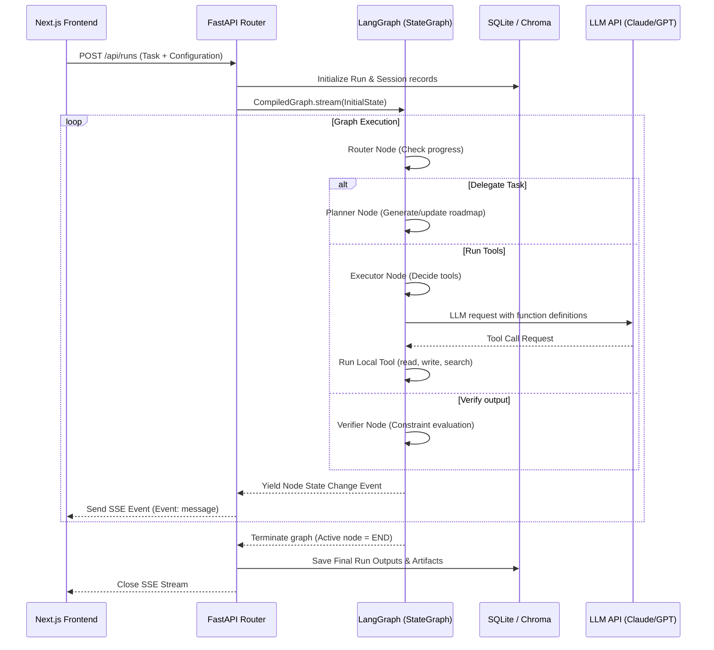

# Backend Architecture & Flow for Agentic Workflows

This document specifies the backend design of the **Hackathon Agent Backbone**. The backend is built using **FastAPI** as the API gateway, **LangGraph** for cycle-based agent orchestration, and **SQLite + Chroma** for local persistence and vector search memory.

---

## 1. Request Lifecycle & Orchestration

The graph is designed as a modular **State Machine (LangGraph)**. Every request follows a deterministic state transition loop controlled by a Supervisor/Router node.



---

## 2. Graph State (`apps/api/app/agents/state.py`)
All nodes share a single typed dictionary that stores conversation history, planner tasks, current agent in focus, and execution variables:

```python
from typing import TypedDict, Annotated, List, Dict, Any
from langchain_core.messages import BaseMessage
import operator

class AgentState(TypedDict):
    messages: Annotated[List[BaseMessage], operator.add]
    planner_steps: List[str]            # Checklist of tasks to perform
    completed_steps: List[str]          # Checklist of tasks completed
    active_agent: str                   # Node name currently executing
    scratchpad: Dict[str, Any]          # Shared variables (e.g. file paths, dataframes)
    artifacts: List[Dict[str, Any]]     # Final files, structures, or results generated
    error: str                          # Set if a node raises an unrecoverable exception
```

---

## 3. Node Definitions (The "Lego Blocks")

### A. Supervisor / Router (`apps/api/app/agents/blocks/router.py`)
- **Responsibility:** Examines the current `messages` history and `planner_steps` to decide which node should run next.
- **Routing Logic:**
  - If no plan exists $\rightarrow$ Route to `planner`.
  - If plan exists and steps remain $\rightarrow$ Route to `executor`.
  - If plan is done but not verified $\rightarrow$ Route to `verifier`.
  - If verifier confirms output is valid $\rightarrow$ Route to `END`.

### B. Planner (`apps/api/app/agents/blocks/planner.py`)
- **Responsibility:** Parses user goals and structures them into sequential milestones.
- **LLM Call:** Uses the prompt of the active domain pack to define structural plans.
- **Output:** Returns updated `planner_steps`.

### C. Executor (`apps/api/app/agents/blocks/executor.py`)
- **Responsibility:** Executes actions using bounded tools.
- **Loop:** Standard ReAct flow. The node invokes the LLM (with tools bound), reads the tool calls requested, triggers the tool registry execution, and records the output in `messages`.

### D. Verifier (`apps/api/app/agents/blocks/verifier.py`)
- **Responsibility:** Runs automated validation or structured LLM reflection on the executor's output to verify constraints (compilation, file outputs, schema validation).
- **Outcome:** Either routes back to `planner` (to fix errors) or returns success.

---

## 4. The Domain Pack Pattern

To keep the backbone pluggable, all system prompts and schema requirements are extracted into **Domain Packs** in `apps/api/app/domain/packs/`.

```json
{
  "pack_id": "scholarship_agent",
  "name": "Scholarship Finder & Writer",
  "description": "Searches for academic scholarships and drafts custom letters.",
  "system_prompt": "You are a scholar agent. Locate scholarships and write application letters...",
  "allowed_tools": [
    "tavily_search",
    "read_file",
    "write_file"
  ],
  "retrieval_collection": "scholarship_rules",
  "output_schema": {
    "type": "object",
    "properties": {
      "scholarships": { "type": "array", "items": { "type": "string" } },
      "letter_draft": { "type": "string" }
    },
    "required": ["scholarships", "letter_draft"]
  }
}
```

The server loads these config files dynamically on startup. Selecting a pack inside the Task Intake UI sends its `pack_id` to the API, which instantly configures the graph node behaviors.

---

## 5. Storage Layer (`apps/api/app/storage/` & `apps/api/app/memory/`)

- **SQLite Engine (`db.py`):**
  - Manages SQLite schema for `sessions` (groups of runs), `runs` (individual graph invocations), `run_steps` (detailed logs of each node), and `artifacts` (files written).
  - Keeps trace logs of all tool calls and inputs/outputs to stream to the UI.
- **Vector Search memory (`vector.py`):**
  - Uses local **ChromaDB** to index domain-specific documents (e.g. PDFs, TXT guides) into custom collections.
  - Exposes an query tool to search documents based on semantic distance.
