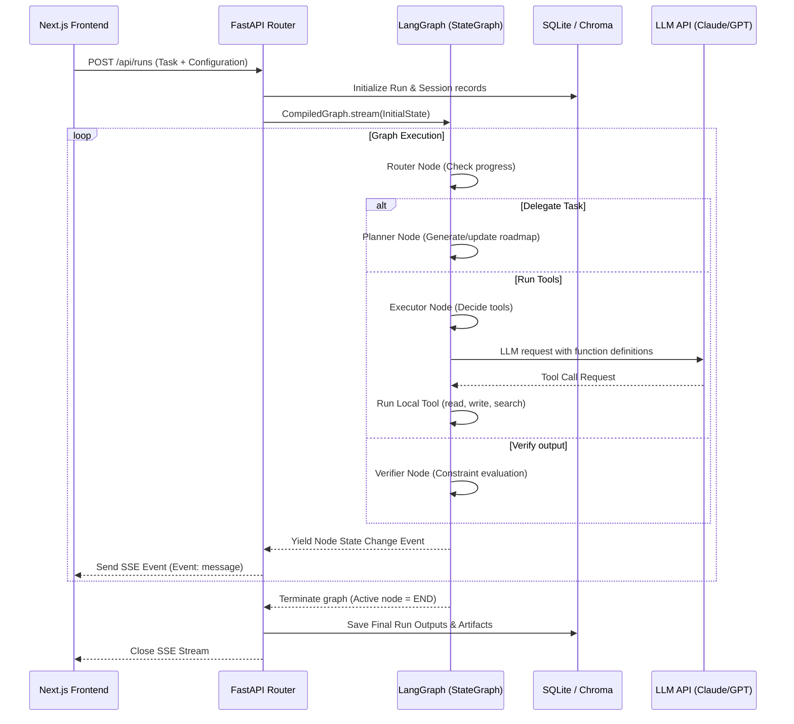

# Backend Architecture & Flow for Agentic Workflows

## Project Intention & Purpose
The backend serves as a pluggable **Lego-Block Agent Orchestrator**. Rather than building custom backend APIs for every new hackathon idea, this backend implements a single core LangGraph execution state machine (Planner -> Executor -> Verifier -> Router). 

By swapping the active **Domain Pack** (e.g. configuring prompts, model selection, local vector store collection, and registering allowed tools), the backend can morph into various use cases like:
1. **Autonomous Scholarship Finder:** Using search and file drafting tools.
2. **Disaster Responder Coordinator:** Parsing news feeds and alerting channels.
3. **Autonomous Code Reviewer:** Inspecting diffs and editing codebase files.
4. **AI Tutor:** Indexing local course guides and generating adaptive practice quizzes.

All run state transitions and tool executions are serialized into SQLite and streamed via Server-Sent Events (SSE) to the frontend.

---


## 1. Request Lifecycle & Orchestration

The graph is designed as a modular **State Machine (LangGraph)**. Every request follows a deterministic state transition loop controlled by a Supervisor/Router node.



---

## 2. Graph State (`apps/api/app/agents/state.py`)
All nodes share a single typed dictionary that stores conversation history, planner tasks, current agent in focus, and execution variables:

```python
from typing import TypedDict, Annotated, List, Dict, Any
from langchain_core.messages import BaseMessage
import operator

class AgentState(TypedDict):
    messages: Annotated[List[BaseMessage], operator.add]
    planner_steps: List[str]            # Checklist of tasks to perform
    completed_steps: List[str]          # Checklist of tasks completed
    active_agent: str                   # Node name currently executing
    scratchpad: Dict[str, Any]          # Shared variables (e.g. file paths, dataframes)
    artifacts: List[Dict[str, Any]]     # Final files, structures, or results generated
    error: str                          # Set if a node raises an unrecoverable exception
```

---

## 3. Node Definitions (The "Lego Blocks")

### A. Supervisor / Router (`apps/api/app/agents/blocks/router.py`)
- **Responsibility:** Examines the current `messages` history and `planner_steps` to decide which node should run next.
- **Routing Logic:**
  - If no plan exists $\rightarrow$ Route to `planner`.
  - If plan exists and steps remain $\rightarrow$ Route to `executor`.
  - If plan is done but not verified $\rightarrow$ Route to `verifier`.
  - If verifier confirms output is valid $\rightarrow$ Route to `END`.

### B. Planner (`apps/api/app/agents/blocks/planner.py`)
- **Responsibility:** Parses user goals and structures them into sequential milestones.
- **LLM Call:** Uses the prompt of the active domain pack to define structural plans.
- **Output:** Returns updated `planner_steps`.

### C. Executor (`apps/api/app/agents/blocks/executor.py`)
- **Responsibility:** Executes actions using bounded tools.
- **Loop:** Standard ReAct flow. The node invokes the LLM (with tools bound), reads the tool calls requested, triggers the tool registry execution, and records the output in `messages`.

### D. Verifier (`apps/api/app/agents/blocks/verifier.py`)
- **Responsibility:** Runs automated validation or structured LLM reflection on the executor's output to verify constraints (compilation, file outputs, schema validation).
- **Outcome:** Either routes back to `planner` (to fix errors) or returns success.

---

## 4. The Domain Pack Pattern

To keep the backbone pluggable, all system prompts and schema requirements are extracted into **Domain Packs** in `apps/api/app/domain/packs/`.

```json
{
  "pack_id": "scholarship_agent",
  "name": "Scholarship Finder & Writer",
  "description": "Searches for academic scholarships and drafts custom letters.",
  "system_prompt": "You are a scholar agent. Locate scholarships and write application letters...",
  "allowed_tools": [
    "tavily_search",
    "read_file",
    "write_file"
  ],
  "retrieval_collection": "scholarship_rules",
  "output_schema": {
    "type": "object",
    "properties": {
      "scholarships": { "type": "array", "items": { "type": "string" } },
      "letter_draft": { "type": "string" }
    },
    "required": ["scholarships", "letter_draft"]
  }
}
```

The server loads these config files dynamically on startup. Selecting a pack inside the Task Intake UI sends its `pack_id` to the API, which instantly configures the graph node behaviors.

---

## 5. Storage Layer (`apps/api/app/storage/` & `apps/api/app/memory/`)

- **SQLite Engine (`db.py`):**
  - Manages SQLite schema for `sessions` (groups of runs), `runs` (individual graph invocations), `run_steps` (detailed logs of each node), and `artifacts` (files written).
  - Keeps trace logs of all tool calls and inputs/outputs to stream to the UI.
- **Vector Search memory (`vector.py`):**
  - Uses local **ChromaDB** to index domain-specific documents (e.g. PDFs, TXT guides) into custom collections.
  - Exposes an query tool to search documents based on semantic distance.

---

## 6. AI Blueprint: Executable Backend Templates

### A. Dependencies (`apps/api/requirements.txt`)
```text
fastapi>=0.110.0
uvicorn>=0.28.0
pydantic>=2.6.0
langchain>=0.1.12
langgraph>=0.0.26
langchain-openai>=0.1.0
langchain-anthropic>=0.1.4
sse-starlette>=2.0.0
chromadb>=0.4.24
pysqlite3-binary>=0.5.2
pytest>=8.0.0
```

### B. Core Server with SSE (`apps/api/app/main.py`)
```python
import json
import asyncio
from fastapi import FastAPI, BackgroundTasks
from fastapi.middleware.cors import CORSMiddleware
from sse_starlette.sse import EventSourceResponse
from pydantic import BaseModel

app = FastAPI(title="Hackathon Agent API")

app.add_middleware(
    CORSMiddleware,
    allow_origins=["*"],
    allow_credentials=True,
    allow_methods=["*"],
    allow_headers=["*"],
)

class RunPayload(BaseModel):
    task: str
    pack_id: str

@app.get("/api/health")
async def health():
    return {"status": "ok"}

@app.post("/api/runs")
async def create_run(payload: RunPayload):
    # Setup run session in SQLite database
    run_id = "run_12345"
    return {"run_id": run_id}

@app.get("/api/runs/{run_id}/stream")
async def stream_run(run_id: str):
    async def event_generator():
        # Setup and load state, then stream LangGraph execution
        nodes = ["planner", "executor", "verifier", "end"]
        for idx, node in enumerate(nodes):
            await asyncio.sleep(1.5) # Simulate thought/action
            event_data = {
                "node": node,
                "status": "complete" if node == "end" else "progress",
                "thought": f"AI thinking in node: {node}",
                "tool_calls": [{"name": "mock_tool", "args": {"input": "test"}, "output": "success"}] if node == "executor" else []
            }
            yield {"event": "message", "data": json.dumps(event_data)}
    return EventSourceResponse(event_generator())
```

### C. LangGraph Orchestrator (`apps/api/app/agents/graph.py`)
```python
from langgraph.graph import StateGraph, END
from app.agents.state import AgentState
from app.agents.blocks.router import route_next
from app.agents.blocks.planner import planner_node
from app.agents.blocks.executor import executor_node
from app.agents.blocks.verifier import verifier_node

def create_agent_graph():
    builder = StateGraph(AgentState)
    
    # Register Node Blocks
    builder.add_node("planner", planner_node)
    builder.add_node("executor", executor_node)
    builder.add_node("verifier", verifier_node)
    
    # Set Entry Point
    builder.set_entry_point("planner")
    
    # Register Conditional and Direct Edges
    builder.add_conditional_edges(
        "executor",
        route_next,
        {
            "continue": "executor",
            "verify": "verifier",
            "replanning": "planner"
        }
    )
    builder.add_edge("planner", "executor")
    builder.add_edge("verifier", END)
    
    return builder.compile()
```
